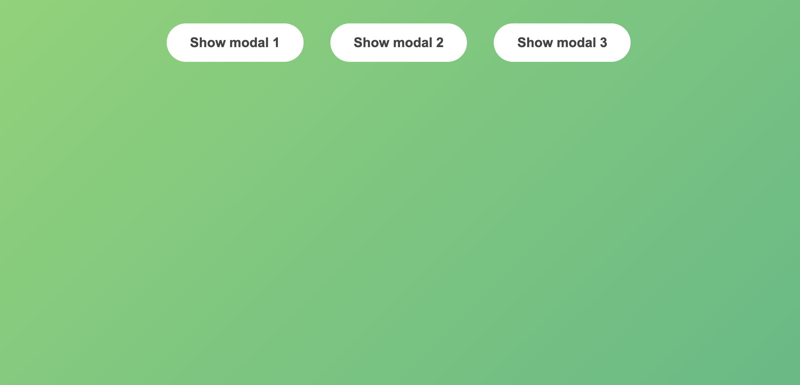
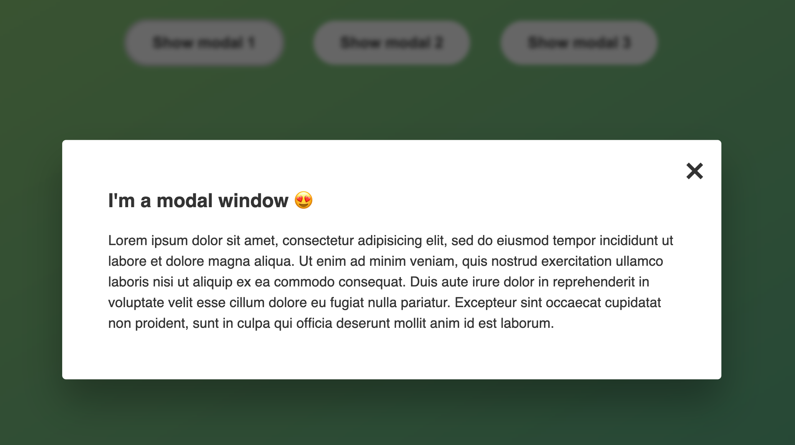

# Modals-JS
This is a simple but useful project that teaches you how to create a modal in JavaScript. A modal is a common website feature that let's you get a little 'card' of information upon clicking on a button. I produced this modal by loosely following a tutorial on Udemy created by Jonas Schmedtmann. Jonas did a great job in picking the colors and writing clear text. I used his code for `index.html` and `style.css`.

## Default View
By default, what you see is a beautiful gradient background with three buttons like so:

## Modals
Once you do click on a button, the modal will open up and you will see the following message (displayed below). You can close the modal in one of three ways: (1) by clicking the X button on the top right corner, (2) by clicking anywhere on the webpage outside of the modal itself, and (3) by pressing the ESC key on the kwyboard. 

